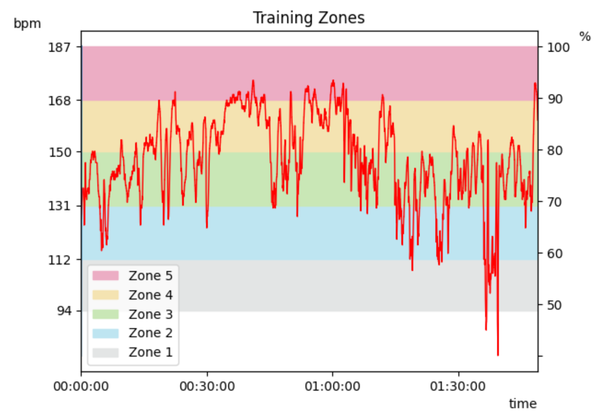

# Polar Flow Session Analysis

Analyze a workout session exported from Polar Flow using Python and Matplotlib.

It recreates some of the information that you can get about a workout from the Polar Flow app.

At the moment, it can provide the following information:

* Activity
* Date
* Start Time
* Duration
* Distance
* Calories
* Average Heart Rate
* Minimum Heart Rate
* Maximum Heart Rate
* Time spent in each training zone
* Session Score

It also allows to make 2 graphs showing the heart rate training zones during a session.

